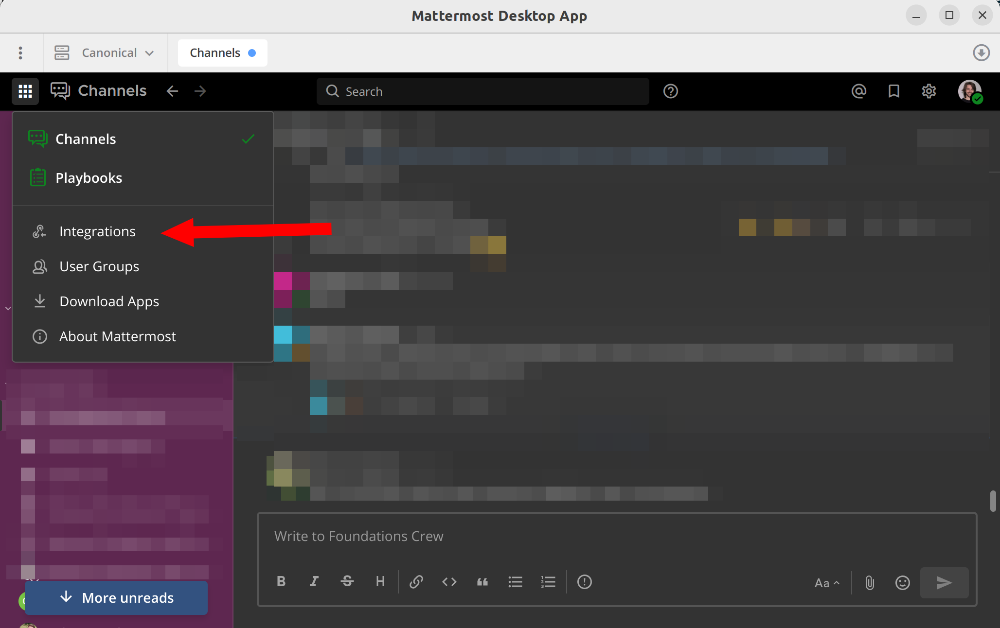
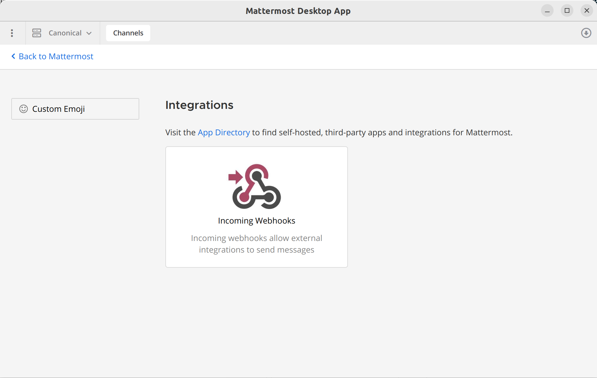
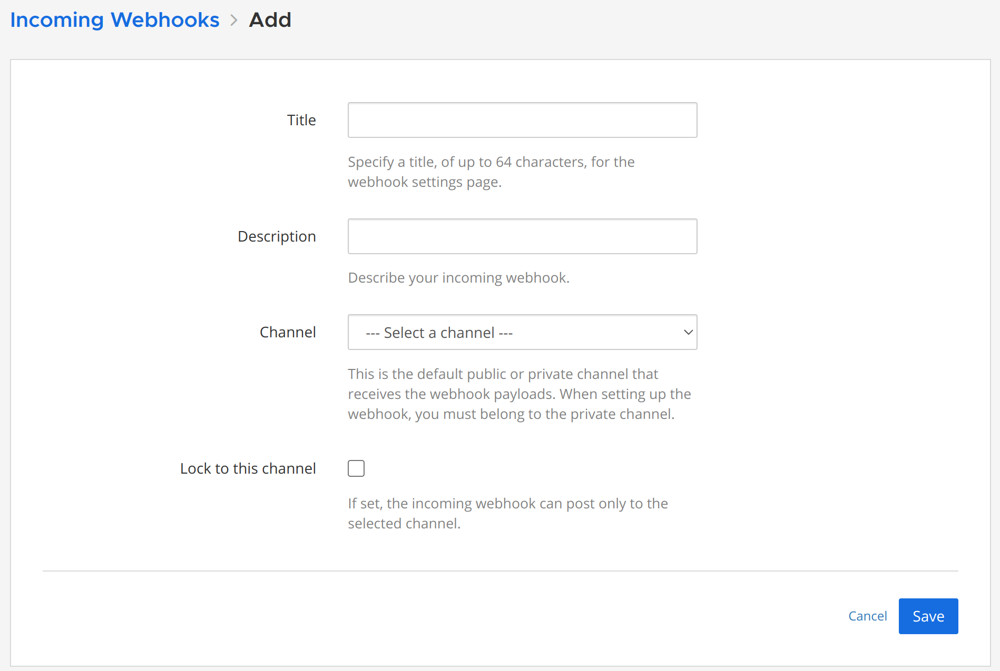
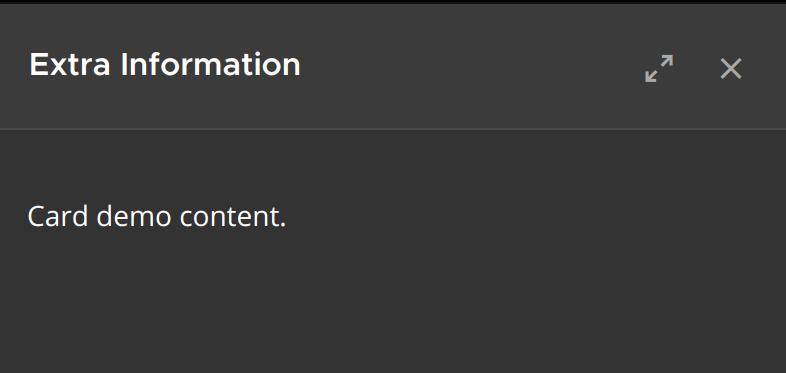

# Mattermost Incoming Webhooks

## Create an Incoming Webhook

Click on "Integrations" > "Incoming Webhooks" > "Add Incoming Webhooks"







## How to use the Webhook URL?

Write a message to the default channel:
```bash
curl -i -X POST -H 'Content-Type: application/json' \
 -d '{"text": "Hello, World!"}' \
 https://your-mattermost-server.com/hooks/GENERATED-KEY
```


**Note the "BOT" tag!**

Write a message to a different channel than the default:
```bash
curl -i -X POST -H 'Content-Type: application/json' \
 -d '{"text": "Hello, World!", "channel": "CHANNEL-NAME" }' \
 https://your-mattermost-server.com/hooks/GENERATED-KEY
```

Write a message with additional content:
```bash
curl -i -X POST -H 'Content-Type: application/json' \
 -d '{"text": "Hello, World!", "props": { "card": "Card demo content." } }'\
 https://chat.canonical.com/hooks/GENERATED-KEY
```




See the [official doumnetation](https://developers.mattermost.com/integrate/webhooks/incoming/) for more details.

## Ideas

### Continuous Integration

For example: [Official Mattermost Github Action](https://github.com/marketplace/actions/mattermost)

```
on: [push, pull_request]

jobs:
  build:
    runs-on: ubuntu-latest

    steps:
    - name: Create the Mattermost Message
      run: |
        echo "{\"text\":\"testing github action :tada:\"}" > mattermost.json
    - uses: mattermost/action-mattermost-notify@master
      env:
        MATTERMOST_WEBHOOK_URL: ${{ secrets.MATTERMOST_WEBHOOK_URL }}
```

### Share Snippets from your Editor

For example: [3rd Party Mattermost Extension](https://marketplace.visualstudio.com/items?itemName=devilop3rz.mattermost)

`.vscode/settings.json`:
```json
{
    "mattermost": 
    {
        "channels":
        [
            {
                "name": "Canonical",
                "url": "https://chat.canonical.com/hooks/GENERATED-KEY"
            }
        ]
    }
}
```